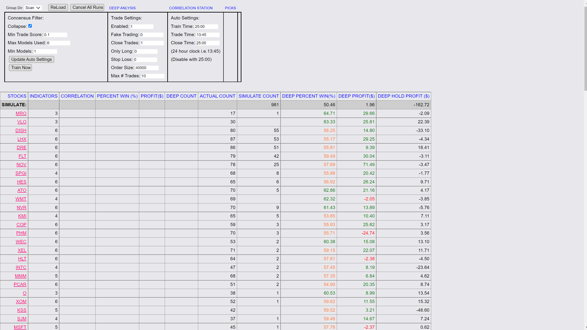
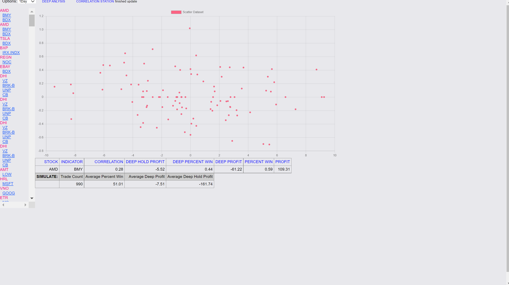

# Stock Trading Algorithm  
*A Personal Data Analysis and Web Visualization Project*

---

This repository contains code and assets from a personal project I undertook with the guidance of a mentor. The main goal of this project was to design and test a stock trading algorithm that detects correlations between various stocks and uses that information to generate trading signals—aiming to remove human bias from trading decisions.

Through this process, I gained hands-on experience in **data analysis**, **algorithm development**, **performance evaluation**, and **web-based reporting**.

---

## Project Overview

The core idea was to identify **statistical correlations between stock pairs** and simulate trades based on those relationships. The strategy aimed to exploit temporary misalignments between correlated stocks, under the assumption that such deviations would revert to the mean.

Although the algorithm’s logic was sound in theory, **backtesting revealed it performed no better than random chance**, with a win rate of ~50%—similar to flipping a coin. This was a valuable insight into the challenges of designing quantitative strategies, and reinforced the importance of rigorous backtesting and skepticism when working with market data.

---

## Key Components

### Algorithm Scripts

These Python scripts form the analytical and simulation core of the project:

- **`Scanner.py`**
  - `pctwintot_calc`: Calculates the percentage of successful trades over the simulation period.
  - `profit_total_calc`: Computes total profit from simulated trades.
  - `get_dayprofit_array`: Tracks and returns profit/loss on a daily basis.

- **`Indicators.py`**
  - `FindCorrelations`: Calculates correlation coefficients between stock pairs over time to detect potential trading signals.

- **`AutoScanner.py`**
  - `SimulateCalcTrades`: Runs simulations using historical stock data to calculate potential trades.
  - `SimulateTrades`: Performs the full simulation loop and logs results for evaluation.

These modules use **NumPy**, **Pandas**, and other Python data libraries to process large sets of historical market data and run simulations.

---

## Web Visualizations (HTML Additions)

I created and customized HTML pages to visualize the algorithm's results and present them more clearly. These dashboards helped communicate performance to non-technical audiences.

### AIDEEP Dashboard

- Implemented a **collapsible UI section** to improve user experience.
- Added a **summary "Total" row** to present cumulative statistics.
- Applied **text color enhancements** for clearer data segmentation.

---

### 🔹 AICORR Dashboard

- Built an interactive **drop-down menu** for selecting time frames or correlation types.
- Enhanced styling with **color-coded highlights** for quick interpretation.

  

---

## 📚 Skills & Tools Used

- **Python** (Pandas, NumPy, Matplotlib)
- **Correlation Analysis & Simulated Trading**
- **Backtesting Techniques**
- **Data Visualization in HTML/CSS**
- **Git for Version Control**
- **Critical Evaluation of Algorithm Performance**

---

## 📉 Final Thoughts

While the project did not result in a profitable trading strategy, it offered me a real-world perspective on:

- The limitations of correlation-based trading strategies.
- The importance of validating ideas with data before deployment.
- Building modular, testable Python scripts and readable dashboards.

It was also a great opportunity to collaborate with a mentor, discuss data-driven logic, and translate analytical work into something visually communicative and interactive.

---
